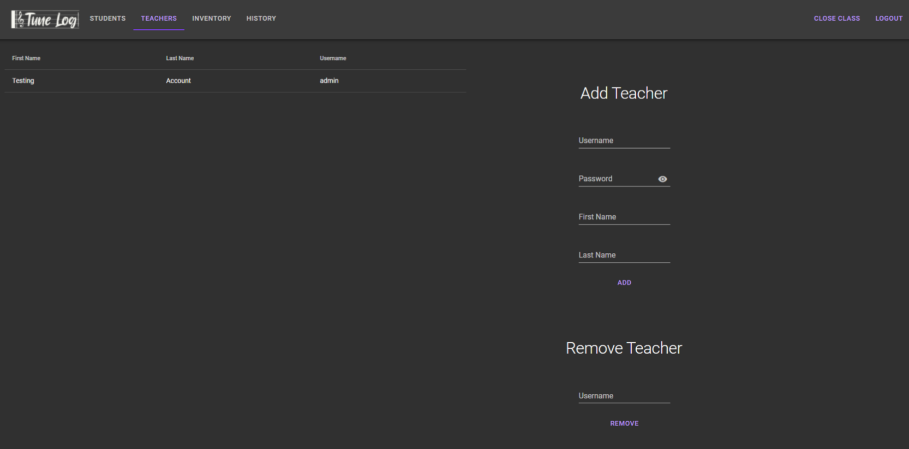

# Musical Instrument Signout System

As part of my Grade 12 Computer Science final project, I was tasked to create a musical instrument signout system that could be used by my school's music department to better keep track of their inventory.

You could have seen the live project [here](https://tunelog.tech).

# Features

Tunelog is a web application that has an inital login interface. Users select whether they are a student or admin, and login with their credentials.

Students are taken to this page to enter an instrument id, and check in or out that particular instrument.

Admins can view and manage the total list of students and their information.

Admins can view and manage the total list of teachers and their information.

Admins can view and manage the total list of instruments in their inventory. They can see the current status of each instrument, and who currently has it checked out.

Admins can view the total history of each interaction with the system, with the timestamp, user, and type of interaction that occurred.

# Stack

- This project was created using Vaadin and MongoDB
- Utilized the Material UI design template
