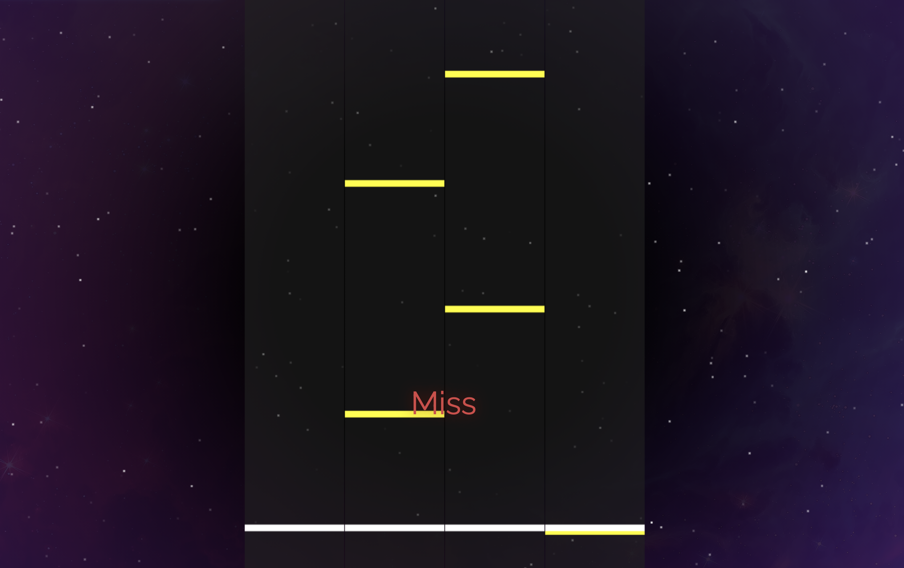

# Rhythm Game

I've always loved playing games, so I figured I would try making one myself. I made this rhythm game using Javascript with the Vue.js framework.

Check out the repo [here](https://github.com/nathan-louie/rhythm-game).

# Features

There are only a certain amount of songs that players can play in this game.

The notes scroll down from the top of the screen, and the player must press the "D", "F", "H", or "J" key corresponding to the column of notes in time.

The player is scored for each game based on the timing of each note press throughout.

# Stack

- This project was created with Javascript and Vue.js
- Utilized Midi.js and Pixi.js
